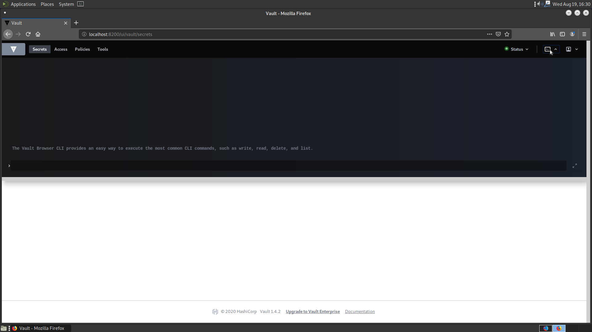

# Creating a secret via the Vault CLI

Secrets can be created using the Vault CLI. This can be accessed by using the `vault` command on the machine that is running the vault installation, or through the Vault CLI in the web UI, which is shown below. If the Vault instance is running on Kubernetes, you can access it with the command:

```bash
kubectl exec -it vault-0 -- /bin/sh
```

Otherwise, this is where the Vault CLI is located in the web UI.



First, we will enable a path for our secrets

```bash
vault secrets enable -path=internal kv-v2
# Success! Enabled the kv-v2 secrets engine at: internal/
```

Then, we will create a secret at the path `internal/database/config` with a `username` and `password`.

```bash
vault kv put internal/database/config username="db-readonly-username" password="db-secret-password"
# Key              Value
# ---              -----
# created_time     2020-08-20T10:03:57.127711644Z
# deletion_time    n/a
# destroyed        false
# version          1
```

We now verify that the secret is created.

```bash
vault kv get internal/database/config
# ====== Metadata ======
# Key              Value
# ---              -----
# created_time     2020-03-25T19:03:57.127711644Z
# deletion_time    n/a
# destroyed        false
# version          1

# ====== Data ======
# Key         Value
# ---         -----
# password    db-secret-password
# username    db-readonly-username
```
