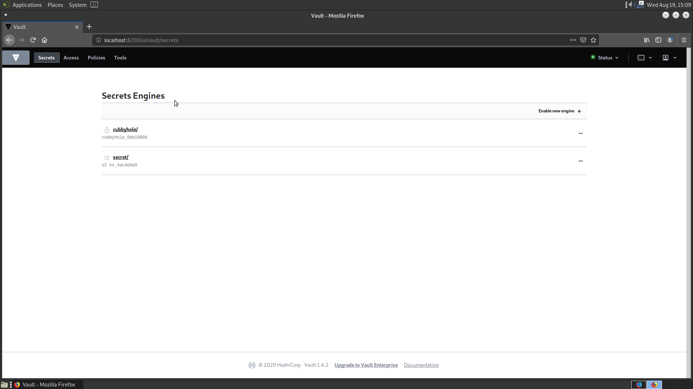
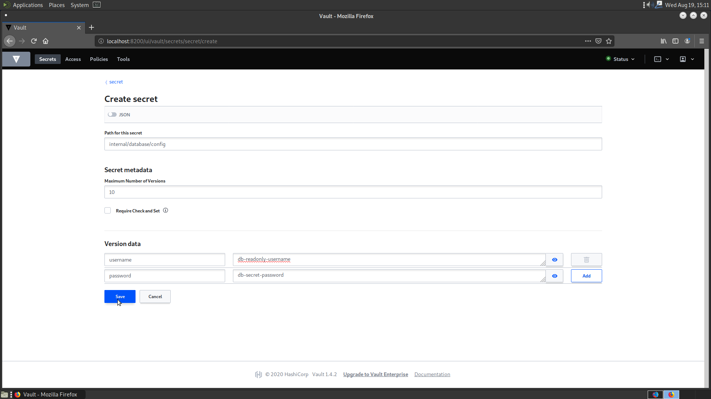
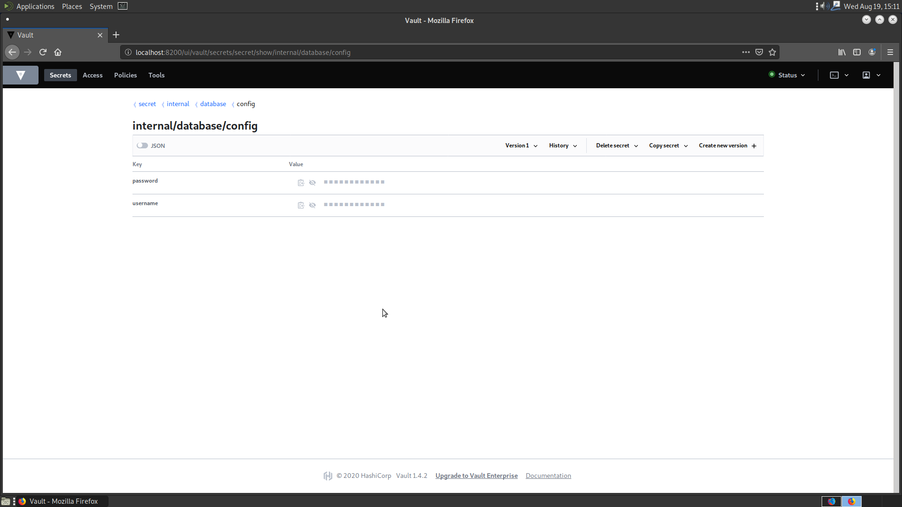

# Creating a KV secret using the Vault Web UI

First, login to your vault instance, then navigate to the Secrets Engine Menu by clicking on `Secrets` in the top bar.

Click on the `secret/` path to see the secrets under the `secret/` backend, which is running using the `kv_v2` engine.

Click on `Create secret`, and then fill in the data for your secrets. You can create a subpath to organize your secret under by separating tiers with a forward slash, as shown below. Under your subpath, you can create multiple secrets.

After you create your secret, the final screen should look similar to this.

